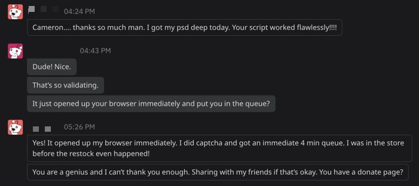

# Get My PS5



A simple command line interface (CLI) utility that checks for PlayStation 5 (disc or digital edition) every 5 seconds, then opens your browser as soon as it's available.

## How can I support this project?

Follow me on Twitter: [@CamThePerson](https://twitter.com/CamThePerson) (feel free to hit me up if you have any trouble)

Donations greatly appreciated (this work takes time):
* [Cash App](https://cash.app/$CamThePerson)
* [Venmo](https://venmo.com/Cameron-Hermens-1)

## Requirements

1. [Node](https://nodejs.org/en/)

## Installation

1. Install [Node](https://nodejs.org/en/) if you haven't already.

2. From the root directory, enter the following command in Terminal (or whatever CLI you use):
```
npm install
```

## Usage

### Searching for your PlayStation 5

1. Make sure you are logged into the [PlayStation Direct store](https://direct.playstation.com/en-us/hardware) prior to using this tool. Also make sure you have a payment method, and shipping and billing addresses configured within your PSN account.

2. From the root directory, enter the following command in Terminal (or whatever CLI you use):
```
npm run watch
```
3. You will be prompted which version (disc or digital) you would like to search for.

4. You will be prompted if you'd like a loud, annoying alarm sound to play (more details on testing this below).

5. Let it run in the background. Your browser will open up and direct you to the PlayStation Direct store as soon as stock is available.

### Testing out the alarm

1. Run the following command to test the alarm sound. It's loud and annoying (you've been warned):

```
npm run sound
```

## FAQ

### Does this thing actually work?

As of Tuesday, December 8, 2020, I've received confirmation that this bot works:


With that being said, this is a simple bot. It checks for a redirect, and then opens your web browser. 
* You should make sure you're already logged in with a PSN ID.
* You'll still need to complete reCAPTCHA on Sony's website.
* There's still a solid chance you _won't_ get a PS5.

However, I believe this utility will give most people a leg up, because they don't have to rely on a third-party service (such as NowInStock.net) to send you a notification that PS5s are in stock. You're running it directly from your computer, which removes a lot of overhead and (hopefully) gives you an advantage.

Good luck!

### How does this work?

This works by hitting Sony PlayStation Direct store every 5 seconds, and checking for a redirect that indicates a queue is forming. As soon as the queue starts forming, it will open your browser and you'll be placed within the queue.

The previous version attempted to add the PlayStation 5 console directly to the cart. Unfortunately, the API endpoint it was using for this didn't return a successful response even when PS5s were in stock, rendering it useless. So I changed it.

### I'm not familiar with CLI and software. How do I install and get this running?

1. Install [Node](https://nodejs.org/en/).
1. Download this utility by clicking the green "Code" button above, and then click "Download ZIP."
1. Unzip the contents.
1. Next you'll need to open a CLI instance at the `get-my-ps5-master` folder:
    * Windows users: open the folder, type `cmd` in the address bar, and hit enter. [Still need help?](https://www.itechtics.com/open-command-window-folder/#:~:text=You%20can%20open%20a%20command,be%20opened%20in%20the%20folder.)
    * Mac users: right click the folder and select "New terminal at folder."
1. Once you have the CLI instance open at the `get-my-ps5-master` folder, enter each command, then press enter:
    * `npm install`
    * `npm run watch`
1. Choose which console you prefer (disc or digital), and the search will begin.
1. Let it do it's thing. It will open your browser as soon as it detects a queue forming.

### How do I stop this from running?

Enter `Control + C` in your Terminal window, or exit the Terminal altogether.