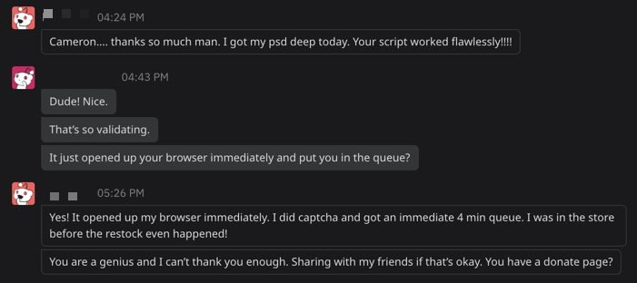

# FAQ

## Does this thing actually work?

As of Tuesday, December 8, 2020, I've received confirmation that this bot works:

With that being said, this is a simple bot. It checks for a redirect, and then opens your web browser. 
* You should make sure you're already logged in with a PSN ID.
* You'll still need to complete reCAPTCHA on Sony's website.
* There's still a solid chance you _won't_ get a PS5.

However, I believe this utility will give most people a leg up, because they don't have to rely on a third-party service (such as NowInStock.net) to send you a notification that PS5s are in stock. You're running it directly from your computer, which removes a lot of overhead and (hopefully) gives you an advantage.

Good luck!

## How does this work?

This software works by hitting Sony PlayStation Direct store every 5 seconds, and checking for a redirect that indicates a queue is forming. As soon as the queue starts forming, it will open your browser and you'll be placed within the queue.

## I'm not familiar with CLI and software. How do I install and get this running?

Check out our [detailed installation guide](./installation.md).

## Is this safe?

This software does not collect or ask for any personal information. And it is open source software, meaning you can look to see exactly how it works.

If you're not using a VPN to mask your IP address (which we highly recommend), you may want to consider strategically limiting how long you let this script run. 

The longer you let this script run, the more likely Sony may notice you repeatedly pinging their website. And then they may ban your IP, which will prevent you from accessing the PlayStation Direct store.

## How do I stop this from running?

Enter `Control + C` in your CLI window, or exit the CLI altogether.

## How do I uninstall this?
Delete the `get-my-ps5` folder.

Seriously. That's it.